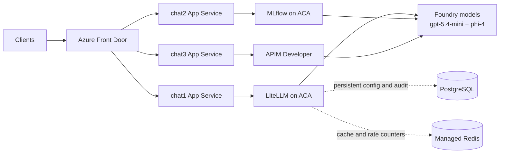

# Parallel Chat Flows

This repository now supports three side-by-side flows that use the same two Foundry models (`gpt-5.4-mini` and `phi-4`):

1. Front Door -> `chat1` web app -> LiteLLM on ACA -> Foundry
2. Front Door -> `chat2` web app -> MLflow on ACA -> Foundry
3. Front Door -> `chat3` web app -> APIM Developer -> Foundry

## Short architecture

## Essential Standalone Packages

Both standalone roots are kept self-contained so any reader can deploy an AI gateway in their own Azure subscription:

- [standalone-litellm](standalone-litellm) (guide: [standalone-litellm/litellm.md](standalone-litellm/litellm.md))
- [standalone-mlflow](standalone-mlflow) (guide: [standalone-mlflow/mlflow.md](standalone-mlflow/mlflow.md))

## Standalone LiteLLM deployment

Use [standalone-litellm/litellm.md](standalone-litellm/litellm.md) to deploy LiteLLM in its own Terraform root/state and its own Container Apps platform.

That guide includes:

- dedicated ACA hosting for LiteLLM
- Mini + Phi model alias configuration for Foundry
- upgrade runbook (`Stage`, `Promote`, `Rollback`)
- backup and restore guidance

## Standalone MLflow deployment

Use [standalone-mlflow/mlflow.md](standalone-mlflow/mlflow.md) for the parallel standalone package entry point.

That guide includes:

- self-contained Terraform root and reusable module structure
- `foundry_account_id` guidance for automatic model role assignments
- admin workflow via `Manage-MLflow.ps1` (`Validate`, `Deploy`, `Stage`, `Promote`, `Rollback`, `BackupStatus`)
- independent state/backend and recovery guidance

## Existing demo stack (`terraform/`)

`terraform/` remains a separate root from the standalone package and now hosts the three Front Door chat entry points.

Application projects:

- [chat-client-litellm](chat-client-litellm) = `chat1` web app (calls LiteLLM)
- [chat-client2](chat-client2) = `chat2` web app (calls MLflow)
- [chat-client3](chat-client3) = `chat3` web app (calls APIM Developer)

| Files | Responsibility |
|---|---|
| [terraform/litellm-chat1.tf](terraform/litellm-chat1.tf) | `chat1` App Service and private endpoint, wired to external LiteLLM base URL |
| [terraform/litellm-chat1-variables.tf](terraform/litellm-chat1-variables.tf) | `chat1` LiteLLM-specific input variables (`base_url`, `api_key`, model aliases, app name) |
| [terraform/litellm-paas.tf](terraform/litellm-paas.tf), [terraform/litellm-paas-variables.tf](terraform/litellm-paas-variables.tf) | Optional LiteLLM support PaaS cache resources (Managed Redis + private endpoint + private DNS), defaulting to minimum `Balanced_B0` |
| [terraform/mlflow-chat2.tf](terraform/mlflow-chat2.tf) | Shared App Service plan plus `chat2` (MLflow-backed) web app and private endpoint |
| [terraform/apim-chat3.tf](terraform/apim-chat3.tf), [terraform/apim-chat3-variables.tf](terraform/apim-chat3-variables.tf) | `chat3` App Service and APIM-specific variables |
| [terraform/apim-developer.tf](terraform/apim-developer.tf) | APIM Developer instance, Foundry routing API/policy, and APIM managed-identity role assignments |
| [terraform/frontdoor.tf](terraform/frontdoor.tf) | Shared Front Door profile and routes for chat1/chat2/chat3, plus MLflow gateway endpoint |
| [terraform/mlflow-gateway-app.tf](terraform/mlflow-gateway-app.tf), [terraform/mlflow-gateway.tf](terraform/mlflow-gateway.tf) | MLflow gateway on ACA |
| [terraform/foundry-models.tf](terraform/foundry-models.tf) | Foundry model deployment + role assignments |
| [terraform/foundry-private-link.tf](terraform/foundry-private-link.tf) | Foundry private connectivity |

File separation inside `terraform/` does not create separate states. The `standalone-litellm/` root is independent and must keep its own state/backend.

## Wiring the three flows

1. Deploy LiteLLM in [standalone-litellm](standalone-litellm) and capture its OpenAI-compatible API URL from `terraform output -json connection` (`api_base_url`, for example `https://.../v1`).
2. In [terraform/terraform.tfvars.example](terraform/terraform.tfvars.example), set `litellm_chat1_base_url` to that standalone LiteLLM API URL and provide `litellm_chat1_api_key` if your proxy requires bearer auth.
3. Keep `mlflow_model_alias`, `phi_model_alias`, `litellm_chat1_model_alias`, and `litellm_chat1_phi_model_alias` aligned to the same two Foundry aliases so chat1/chat2/chat3 test identical model paths.