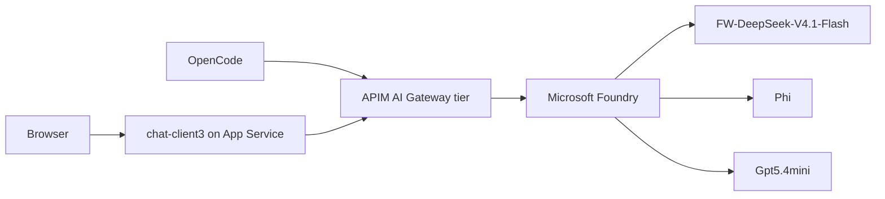

# App3 with Azure API Management AI Gateway

The active deployment is an isolated Sweden Central architecture:

```mermaid
flowchart LR
	U[Browser] --> C3[chat-client3 on App Service]
	OC[OpenCode] --> A3[APIM AI Gateway tier]
	C3 --> A3
	A3 --> F[Microsoft Foundry]
	F --> D[FW-DeepSeek-V4.1-Flash]
	F --> P[Phi]
	F --> G[Gpt5.4mini]
```

Azure Front Door is not used. App3 has a direct App Service HTTPS endpoint;
app3 and OpenCode use separate AI Gateway runtime keys. The gateway uses its
system-assigned managed identity and the account-scoped Foundry User role to
call model deployments without Foundry API keys.

## Active Terraform root

[terraform/apim-only](terraform/apim-only) has its own state and deploys only:

- `chat-client3` on Linux App Service with .NET 10
- API Management in the public-preview `AIGateway` pricing tier
- a Microsoft Foundry `AIServices` account
- `Gpt5.4mini`, `Phi`, and `FW-DeepSeek-V4.1-Flash` gateway aliases
- dedicated runtime keys for app3 and OpenCode

The requested DeepSeek name maps to the GA Foundry catalog model
`DeepSeek-V4-Flash` version `2026-04-23`. A model-scoped AI Gateway cost-limit
policy partitions a combined $200 monthly budget across app3, OpenCode, and Zed.

See [terraform/apim-only/README.md](terraform/apim-only/README.md) for deployment
and local OpenCode details.

## Retained legacy definitions

The original [terraform](terraform) root still contains chat1, chat2, LiteLLM,
and MLflow definitions for later use. They are not part of the active isolated
state and were not deployed. The Front Door resource file and all Terraform
references to it were removed.

The standalone packages also remain unchanged:

- [standalone-litellm](standalone-litellm)
- [standalone-mlflow](standalone-mlflow)