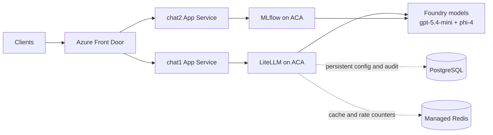

# Standalone LiteLLM on Azure: administrator guide

This package deploys **one independent LiteLLM platform**. It does not reference this repository's demo resources, Foundry, chat apps, Front Door, or their Terraform state. Copy this whole directory to deploy it elsewhere. It is Azure-specific infrastructure, but **LLM-provider-agnostic**.

An authorized administrator supplies core deployment values once. Subsequent operations use the same settings file plus a few action parameters. An Azure subscription with permissions, supported regional SKUs/quota, reachable model endpoints, and model credentials are still prerequisites, not resources that Terraform can eliminate.

## Short architecture



## Resources, briefly

| Resource | Purpose / default |
|---|---|
| Resource group | Own lifecycle; generated unique name or a new custom name |
| VNet and three subnets | Dedicated ACA /23, PostgreSQL /24, private endpoints /27 inside configurable /16 |
| Container Apps environment | Consumption workload profile, VNet integration, optional internal ingress |
| LiteLLM Container App | Pinned image, 2 vCPU / 4 GiB, one worker, 1–3 replicas, HTTP concurrency 25; multiple revisions |
| Probes and drain | Startup allowance about ten minutes, HTTP readiness/liveness, 300-second termination grace |
| PostgreSQL Flexible Server | PostgreSQL 16, B1ms, 32 GiB, seven-day automated backup/PITR; no public access |
| Azure Managed Redis | Balanced B0, non-HA, TLS, NoCluster, NoEviction, private endpoint |
| Private DNS and links | Private database/cache resolution; wildcard ACA zone for internal ingress |
| User-assigned identity | Available for optional model-provider authentication; no model RBAC granted automatically |
| Log Analytics | Container platform/application logs, 30-day retention |
| Generated credentials | Separate master key, local admin password, database password and durable encryption salt |

### PostgreSQL and Redis roles in production

- PostgreSQL is the persistent system of record for proxy configuration, authentication data, virtual keys, user/team access records, spend tracking, and compliance-oriented audit logs.
- Redis is the high-throughput memory layer for response caching, distributed rate-limit counters, and short-lived session or coordination state across horizontal proxy replicas.

**Cost profile, not an HA production claim:** PostgreSQL B1ms and non-HA Redis are economical defaults. Keep at least two warm replicas, size PostgreSQL for both revisions' maximum pools, enable suitable PostgreSQL/Redis HA, and assess ACA zone redundancy before a production SLA commitment. This module does not currently expose ACA zone redundancy. Multiple active revisions cost more. Redis state can be lost; PostgreSQL is the durable record. Response caching is disabled (`supported_call_types=[]`), while Redis supports shared coordination. Do not depend on this low-cost topology for strict fault-tolerant budget enforcement.

## 1. Prerequisites

- Terraform **1.9+**, below 2.0; PowerShell **7.2+** for the admin wrapper; current Azure CLI with Container Apps commands. Validation here used AzureRM **5.5.0** and Random **3.9.1**. Keep the generated provider lock file with the package.
- Azure sign-in to the **customer's** tenant/subscription. Contributor-like resource creation rights at subscription scope are needed because the package creates a resource group. Identity creation/assignment permissions are also needed. Model RBAC, if desired, needs separate role-assignment rights.
- A subscription administrator must register `Microsoft.App`, `Microsoft.OperationalInsights`, `Microsoft.Network`, `Microsoft.DBforPostgreSQL`, `Microsoft.Cache`, and `Microsoft.ManagedIdentity`. The provider deliberately does not register services silently. Check regional B0, PostgreSQL and ACA quota/availability and subscription policy before deployment.
- Choose unused VNet space. Default is `10.80.0.0/16`; it must not overlap networks you later peer. This version creates a new VNet; it does not attach to an existing platform VNet or create peering/VPN/Firewall.
- Public registry access to the chosen LiteLLM image. Private-registry pull credentials are not implemented. Review licenses, release provenance and vulnerabilities; use an approved digest, not `main-stable` or `latest`.
- PostgreSQL and Redis require password/access-key authentication in this package. Policies prohibiting those authentication modes require adaptation, not a policy bypass.

```powershell
az login --tenant '<customer-tenant-id>'
az account set --subscription '<customer-subscription-id>'
az provider register --namespace Microsoft.App --wait
az provider register --namespace Microsoft.OperationalInsights --wait
az provider register --namespace Microsoft.Network --wait
az provider register --namespace Microsoft.DBforPostgreSQL --wait
az provider register --namespace Microsoft.Cache --wait
az provider register --namespace Microsoft.ManagedIdentity --wait
```

## 2. Supply settings and deploy

Work in this standalone directory, **not** in the sibling demo's Terraform directory. Use **one** variable-file approach: the JSON admin workflow below, or the HCL example for direct Terraform—not both with conflicting values.

```powershell
Copy-Item ./admin.tfvars.json.example ./admin.tfvars.json
```

Edit the placeholders in `admin.tfvars.json`. The documentation-only CIDR `203.0.113.10/32` must be replaced with your actual corporate/client egress CIDR. Include all legitimate API clients, not just the admin laptop. `/0` is rejected. Keep the image's full `@sha256:...` reference from an approved release manifest. No particular future release is assumed to exist. If this LiteLLM deployment will proxy Microsoft Foundry models, set top-level `foundry_account_id` so Terraform grants the LiteLLM managed identity both required roles automatically.

```powershell
./Manage-LiteLLM.ps1 -Action Validate
./Manage-LiteLLM.ps1 -Action Deploy
./Manage-LiteLLM.ps1 -Action Status
```

The wrapper initializes Terraform, validates, saves a plan, rejects incomplete/destructive plans, and requires typing **APPLY** before applying. A saved plan is not automatically safe merely because Terraform produced it. Review the full plan. A failed/cancelled operation leaves desired settings saved so you can inspect/retry; it does not claim Azure is up to date. `-WhatIf` reports intent only, without initialization, writes or cloud operations; it is **not** a deployability check.

Direct Terraform equivalent:

```powershell
terraform init
terraform validate
terraform plan -var-file admin.tfvars.json -out deployment.tfplan
# After reviewing the complete successful plan:
terraform apply deployment.tfplan
terraform output -json connection
```

Do not run two admins' operations concurrently. The default root uses local state for portability; **before a shared/production deployment**, configure an encrypted remote backend with locking, restricted RBAC and versioning in customer-owned storage or HCP Terraform. Use a unique state key per installation. Backend bootstrap is intentionally outside this package so customers choose their state platform. Never reuse this repo's demo state, copy its private tfvars, or run `terraform import` on a `.tf` file. Terraform modules are called, not imported as files.

### Access and credentials

`Status` prints the direct HTTPS proxy/admin/API URLs, identity and network details. Admin UI ends in `/ui/`. Credentials can be retrieved locally with `terraform output -json credentials` **only on a trusted, non-recorded terminal**; that explicitly reveals sensitive output. Store them in the organization's secret manager. Do not distribute the master key to apps: create scoped LiteLLM virtual keys instead.

The TLS certificate is managed by ACA. Optional `public_base_url` is for redirects behind a customer-supplied gateway; it does **not** create custom domains, DNS, Front Door, certificates or gateway access restrictions. With `private_ingress=true`, the ACA environment is internal even though app ingress is enabled outside that environment. Clients need routed VNet access and DNS resolution; Azure CLI control-plane access alone does not provide data-plane access. The module's private DNS link is for its own VNet; customer DNS forwarding/peering remains an integration task. Do not remove allowlists to troubleshoot.

### Models: choose either configuration or Admin UI

An empty model list boots the platform for administration; inference needs a real configured backend. Add models in the Admin UI (stored encrypted in PostgreSQL), or set `deployment.model_list`. For example:

```json
"provider_environment": { "OPENAI_API_BASE": "https://api.openai.com/v1" },
"model_list": [{
  "model_name": "my-chat-model",
  "litellm_params": {
    "model": "openai/YOUR_MODEL_ID",
    "api_base": "os.environ/OPENAI_API_BASE",
    "api_key": "os.environ/OPENAI_API_KEY"
  }
}]
```

Have your secret manager set `TF_VAR_provider_secrets` to a JSON map such as `{"OPENAI_API_KEY":"<secret>"}` **without logging its value**. The module converts these to ACA secret references. Never put literal API keys in `model_list` or `provider_environment`; both are nonsecret configuration and appear in plans. Base64 config encoding only avoids shell substitution; it is not encryption.

Azure/Foundry is optional: use an `azure/<deployment-name>` model, your endpoint/API version via provider environment, and grant the output managed-identity principal the narrowly scoped required model-service role. In this standalone root, setting `foundry_account_id` creates both role assignments automatically (`Cognitive Services OpenAI User` and `Cognitive Services User`) for Mini/Phi dual routing. The deployment does not provision a Foundry account. Private model endpoints still need customer DNS/network integration.

For this repository's parallel flow (`chat1 -> LiteLLM -> Foundry`), keep the LiteLLM aliases aligned with the MLflow flow:

```json
"provider_environment": {
  "AZURE_API_BASE": "https://<foundry-account>.openai.azure.com",
  "AZURE_API_VERSION": "2024-10-21",
  "AZURE_AI_API_BASE": "https://<foundry-account>.services.ai.azure.com/models"
},
"model_list": [
  {
    "model_name": "gpt-5.4-mini",
    "litellm_params": {
      "model": "azure/gpt-5.4-mini",
      "api_base": "os.environ/AZURE_API_BASE",
      "api_version": "os.environ/AZURE_API_VERSION"
    }
  },
  {
    "model_name": "phi-4",
    "litellm_params": {
      "model": "azure_ai/Phi-4",
      "api_base": "os.environ/AZURE_AI_API_BASE",
      "api_version": "2024-05-01-preview"
    }
  }
]
```

**Terraform state and saved plans contain secrets even when marked sensitive.** Credentials are not stored in Key Vault by this package. Restrict state/backups, avoid debug/TRACE logs, and never commit private settings or state. Keep `LITELLM_SALT_KEY` stable forever unless following LiteLLM's supported re-encryption process; losing/changing it makes saved model credentials unreadable. Do not rotate shared secrets during an image canary: ACA secrets are application-scoped, not isolated by revision.

### Calling the reusable module from another root

Copy the module folder to your repository and call it with the same `deployment` object:

```hcl
module "litellm" {
  source           = "./modules/litellm"
  settings         = var.deployment
  provider_secrets = var.provider_secrets
  providers        = { azurerm = azurerm, random = random }
}
```

The caller supplies provider configuration, variable declarations and backend. Child modules use the **caller's state**, not an independent state automatically. The PowerShell wrapper operates the included root/output contract; custom callers use Terraform directly or expose the same outputs.

## 3. Backup and recovery

### Automated backup: no daily admin command required

PostgreSQL enables automated snapshots and WAL-based point-in-time recovery. `postgres_backup_days` defaults to 7; supported retention is 7–35 days. Confirm backup health and rehearse restoration. These backups expire, are tied to the source server, and are not a separately retained export. Database/server `prevent_destroy` guards Terraform plans, but does not protect against portal deletion or removing the resource blocks; it is not a backup.

**Important for cheap B1ms:** Azure PostgreSQL Burstable supports automatic backups/PITR but does **not** support on-demand physical backups. No custom export scripts, `pg_dump`, backup jobs or certificates are needed here.

### Configure retention and check status

Set `deployment.postgres_backup_days` to an integer from 7 to 35 in your settings and apply through `Deploy`. Azure then manages the backups without daily administrator actions. Backups are encrypted by the managed service. This package uses local backup redundancy; it does not provision a backup vault, long-term retention or cross-region backup.

```powershell
./Manage-LiteLLM.ps1 -Action BackupStatus
```

This is a read-only control-plane check of server state and backup settings; it does not trigger a new snapshot or certify recoverability. Check the server's **Backup and restore** pane in Azure Portal for available restore points, especially before upgrades.

PostgreSQL backups cover the database, including LiteLLM model metadata, virtual keys and spend records. They do **not** include Terraform state, image/config files, the master key or `LITELLM_SALT_KEY`. Preserve code and the provider lock file in source control; protect state with a versioned encrypted backend and escrow important secrets in your organization's secret manager. Redis is transient coordination/cache state and is not backed up by this package. Reconcile budget counters if Redis state is lost.

### Native PaaS restore drill

1. In the PostgreSQL server's Azure Portal **Backup and restore** pane, choose an available restore time within retention. PITR **always creates a new server**, never overwrites the original. Verify region, subnet/private DNS, credentials and restored data.
2. Preserve the original LiteLLM image/config and salt/master keys. Database-stored credentials encrypted using the old salt cannot be read with a newly generated salt.
3. Review how to attach the restored server to the application: update the private database URL and reconcile Terraform ownership/imports. This module creates its own server and does **not** automate attaching a PITR server. A platform administrator must plan that recovery change; do not blindly push old Terraform state or delete the original server.
4. Test model credentials, virtual keys, spend records and inference before production cutover. Prevent unreviewed schema migrations. Reconcile writes since the restore time and any lost Redis counters. Record the recovery point/time achieved and retain the original server until recovery is proven.

## 4. Updating LiteLLM without planned request downtime

### What can and cannot be guaranteed

ACA keeps old and new revisions available so a **compatible, tested release** can be rolled out without planned interruption. That does **not** guarantee zero downtime for every LiteLLM release, a region outage, insufficient quota, database locks, incompatible schema changes, or streams longer than the permitted drain time. Database restore is a recovery operation, not instant traffic rollback.

Do not auto-deploy every published image. No moving tags. Do not use `allow_requests_on_db_unavailable` to make readiness look healthy while bypassing database-backed controls.

### Mandatory migration gate—before starting a candidate

1. Read upstream release notes/security advisories and review configuration, Redis-format and schema changes from the current version to the target. Resolve the actual approved image to an immutable digest. Do not combine provider upgrades, network changes, key rotation or PostgreSQL SKU changes with this rollout.
2. Verify automated PostgreSQL backups and an available recent restore point; rehearse restore. Record that restore point and keep the old image/config/keys. Verify capacity for both active revisions, their workers and DB connection pools. Increase warm replicas before the release if needed.
3. Rehearse on an isolated restored database and separate Redis: start old and new versions, run migration/load/model/streaming tests, and confirm the old version remains functional after the new schema is present.
4. LiteLLM normally runs `prisma migrate deploy` on startup. A **zero-traffic** candidate can still migrate the shared DB and run background jobs. Setting traffic to 0 is not database isolation. `USE_PRISMA_MIGRATE` is obsolete; do not use it.
5. For an existing initialized database, set `disable_schema_update=true` for serving revisions. If the release needs a migration, execute its **verified, release-specific migration procedure once**, from a controlled VNet-connected maintenance runner/ACA Job with the candidate image and private database secret. Check that image's migration command, working directory, bundled schema and entrypoint. This package does not invent a universal Prisma command or install a Helm hook on ACA. Verify completion before staging a serving candidate. Ensure the old serving revision cannot re-run migrations when restarted during this window.
6. If compatibility cannot be demonstrated, **stop the zero-downtime path** and schedule maintenance or engineer an expand/contract migration. `-MigrationReviewed` is the admin's acknowledgement, not an automated proof or a command that runs migrations.

Initial bootstrap uses `disable_schema_update=false`, **allowing schema initialization**. After bootstrap, establish `disable_schema_update=true` on the current image as a separate reviewed rollout before production upgrades. The `Stage` action enforces it for candidates.

### A. Inspect current deployment

```powershell
./Manage-LiteLLM.ps1 -Action Status
```

Resolve any drift first; settings must describe the live template. There must be one stable revision at 100%. Keep source/lock files and desired settings under your normal change-control process (without secrets).

### B. Stage a new image, keeping old traffic at 100%

```powershell
./Manage-LiteLLM.ps1 -Action Stage -Image 'ghcr.io/berriai/litellm@sha256:<approved-64-hex-digest>' -RevisionSuffix 'r20260908a' -MigrationReviewed
```

`Stage` performs **two separately reviewed Terraform applies**:

1. Freeze traffic to the exact current stable revision name at 100% (no `latest=100`).
2. Set the candidate image/new unique suffix and disable schema updates, while preserving that explicit stable traffic pin.

It updates the JSON settings so subsequent applies retain the image and traffic intent. Never use `Deploy` as a shortcut to change images while the bootstrap traffic rule is still `latest=100`. An apply failure is not a reason to deactivate the old revision.

### C. Check candidate before moving any traffic

Use names returned by `Status`. Example read-only commands:

```powershell
$c = terraform output -json connection | ConvertFrom-Json
$candidate = "$($c.container_app_name)--r20260908a"
az containerapp revision show --name $c.container_app_name --resource-group $c.resource_group_name --revision $candidate --query 'properties.{health:healthState,provisioning:provisioningState,active:active,fqdn:fqdn}' -o json
```

Wait for active, `Provisioned`, `Healthy` and successful probes. From an **allowed** client/network, use the revision-specific FQDN returned above (not the app URL, which still serves stable) to test:

- `/health/liveliness` and `/health/readiness` return successful status. LiteLLM spells **liveliness** this way. Verify unauthenticated probe behavior for the chosen image; do not substitute a TCP-only probe just to hide dependency failures.
- Authenticated `/cache/ping` reports Redis healthy with successful ping/set. Confirm private DNS and TLS; inspect logs for auth/TLS/migration errors and OOMs.
- `/v1/models`, a real completion for **each** configured backend and a streaming completion using a scoped test key. Include rate limits/budgets and spend persistence.
- Admin login and redirects on the production URL after a controlled canary. A revision URL's admin redirect can intentionally return to `PROXY_BASE_URL`, so it is not proof that UI traffic stayed on the candidate.
- Compare error rate, p95 latency, CPU/memory, replicas, DB connections/locks and Redis memory. Health alone does not prove backend inference works.

Do not relax the ingress allowlist to reach a revision hostname. Old deployments limited to Front Door backend ranges may require a VNet-based test host or a carefully scoped separate test origin; this independent package does not modify the existing demo's Front Door.

### D. Promote gradually

Supply full revision names from `Status`; keep the old revision active.

```powershell
$stable = '<app-name>--<stable-suffix>'
$candidate = '<app-name>--r20260908a'
./Manage-LiteLLM.ps1 -Action Promote -StableRevision $stable -CandidateRevision $candidate -Percent 5 -SmokeTestPassed
# Observe a representative workload and agreed metrics before each next step.
./Manage-LiteLLM.ps1 -Action Promote -StableRevision $stable -CandidateRevision $candidate -Percent 50 -SmokeTestPassed
./Manage-LiteLLM.ps1 -Action Promote -StableRevision $stable -CandidateRevision $candidate -Percent 100 -SmokeTestPassed
```

At every step the wrapper checks target revision health and creates a reviewed Terraform plan. The percentages are routing weights, not precise per-user sampling. Traffic changes do not migrate existing streaming connections. Observe at 100% for your agreed rollback window. Wait until old in-flight requests/streams and buffered spend writes finish before deactivation. The 300-second termination grace is only a bounded opportunity to drain; verify actual release shutdown behavior and all client/gateway timeouts under load.

### E. Roll back traffic if required

```powershell
./Manage-LiteLLM.ps1 -Action Rollback -StableRevision $stable -CandidateRevision $candidate
```

This pins 100% to the old healthy revision and 0% to the candidate, persisting the weights in Terraform settings. It intentionally retains the latest template's image/suffix: trying to recreate an old immutable revision by reverting its suffix can fail. Keep the rollback revision warm. If old code cannot read the migrated database, **do not use this as a schema rollback**; invoke the tested recovery/maintenance procedure.

For an emergency where a Terraform plan is too slow, an authorized operator can use:

```powershell
az containerapp ingress traffic set --name $c.container_app_name --resource-group $c.resource_group_name --revision-weight "$stable=100" "$candidate=0"
```

Then immediately persist those exact weights in `deployment.traffic_weights`, review a fresh Terraform plan, and reconcile drift **before any further apply**. Do not maintain competing CLI/Terraform owners. No `ignore_changes` silently hides traffic/image drift in this module.

After the observation/drain window and backup verification, deactivate the obsolete revision explicitly to stop its cost and background jobs:

```powershell
az containerapp revision deactivate --name $c.container_app_name --resource-group $c.resource_group_name --revision $stable
```

Only do this after removing its zero-percent entry from desired `traffic_weights` and applying the new-only 100% map. Deactivation is an explicit operator lifecycle action; the wrapper does not deactivate revisions automatically. After rollback, deactivate only the failed candidate once drained, keeping the stable revision pinned. Do not let active revisions accumulate indefinitely.

### Existing demo versus this package

These commands target the **standalone root only**. The existing demo currently uses its own Terraform ownership/settings and must be inspected independently. Do not apply this package over it or assume its revision mode/probes changed. If using the same rollout pattern there, first make a reviewed change in that stack to Multiple mode and explicit stable traffic, with database/probe/migration gates, before creating any candidate.

## 5. Operational limits and checks

- `Validate` checks syntax/provider schema, not Azure policy, quota, DNS, runtime startup, image existence, credentials or restore success. Local mocked tests do not certify a live deployment.
- `BackupStatus` inspects native backup settings; full production recovery intentionally needs a reviewed PaaS restore and cutover, not a destructive one-click restore.
- PostgreSQL uses TLS with `sslmode=require`. That encrypts traffic but does not itself guarantee certificate/hostname verification. Production hardening should test the chosen image/Prisma driver's `verify-full`/CA-bundle configuration. Redis uses encrypted protocol and TLS client settings.
- No WAF, private registry, Key Vault, customer-managed encryption key, automated alert rules, firewall egress controls, cross-region DR or backup vault is provisioned. Add these based on customer requirements.
- The wrapper rejects delete/replacement plans and offers no Destroy action. For intentional retirement, back up and separately review database protection removal, resource deletion and state retention.
- A few parameters make repeatable operations simpler; they do not remove the need for access control, release compatibility review, tested backups and monitoring.

## References

- [ACA revisions and traffic behavior](https://learn.microsoft.com/azure/container-apps/revisions)
- [ACA health probes](https://learn.microsoft.com/azure/container-apps/health-probes)
- [ACA traffic splitting](https://learn.microsoft.com/azure/container-apps/traffic-splitting)
- [LiteLLM production, migrations and Redis guidance](https://docs.litellm.ai/docs/proxy/prod)
- [PostgreSQL backup/restore and Burstable limitations](https://learn.microsoft.com/azure/postgresql/backup-restore/concepts-backup-restore)
- [Terraform state security](https://developer.hashicorp.com/terraform/language/state/sensitive-data)